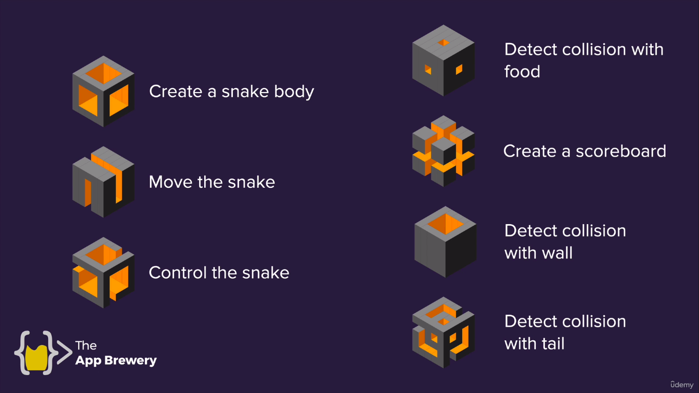

# Juego de la víbora

Famoso juego de la víbora que venía en el teléfono Nokia 1100.

Este juego corresponde a los días 20 y 21 de curso **100 Days of Code**.

El juego se desarrolló siguiendo los siguientes pasos:

[Documentación de Turtle Graphics](https://docs.python.org/3/library/turtle.html#module-turtle)